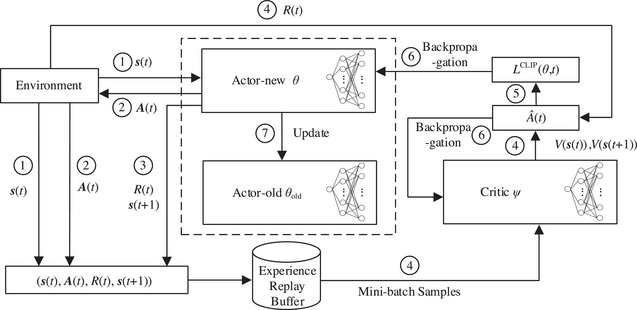

# Clean RL's Implementation of PPO



## Why PPO?

Considered to be stable, its able to limit or constraint the policy updates so the deviation are within a 'trust region'.

Brief explanation of TRPO, it uses the trust region between two Policies, in this case it would be the old and new actor.

1. Normalizes action -> This forms a policy ratio.
2. Constrains average KL divergence between new and old policies to be less than a defined constant.
3. TRPO is guaranteed to improve monotonically, but it is is complicated to solve practically.
4. **From TRPO to PPO.** We want an algorithm with the benefits of TRPO—**e.g., stability, data efficiency, and reliability**—but without its complexity. PPO’s objective is inspired by the TRPO but replaces the hard KL constraint with a clipping mechanism to enforce a trust region in a simpler way.

## PPO training process

PPO goes beyond a single policy update in each step, alternating between Actor and Critic.

*Note: Clean Rl's implementation does not include a copy of the old Actor instead it's clever way of finding the ratio can be seen as:*

```
logratio = newlogprob - b_logprobs[mb_inds] #Probability ratio
```

b_logprobs -> Old Policy stored at data collection time.

newlogprob -> New Policy comes from current Model of get_action_and_value.

1. Sampling new data or trajectories from the policy.
2. Performing several policy updates over the sampled data.

#### Training Process Visualized:

- **Collect rollout** using old policy: store `logprobs`, `rewards`, `values`
- **Compute GAE advantages** and **returns**
- **Recompute new logprobs, values** for minibatches
- Compute:

  - `pg_loss`: clipped policy gradient loss
  - `v_loss`: critic regression loss
  - `entropy`: exploration bonus
- Combine and backpropagate using loss.
- One `loss.backward()` Updates Both Actor and Critic.

### CleanRL PPO: Glossary with Equations and Code Mapping


| Term / Equation                                            | Description                                  | CleanRL Variable / Code                       |
| ------------------------------------------------------------ | ---------------------------------------------- | ----------------------------------------------- |
| `s_t`                                                      | State at timestep*t*                         | `obs`, `next_obs`                             |
| `a_t`                                                      | Action taken at timestep*t*                  | `actions`                                     |
| `r_t`                                                      | Reward received at timestep*t*               | `rewards`                                     |
| `π(a_t‖s_t)`                                             | Current policy probability                   | Computed in`agent.get_action_and_value()`     |
| `π_old(a_t‖s_t)`                                         | Policy used during rollout                   | Stored as`logprobs`                           |
| `log π(a_t‖s_t)`                                         | Log-probability under current policy         | `newlogprob`                                  |
| `log π_old(a_t‖s_t)`                                     | Log-probability under old policy             | `logprobs`                                    |
| `r_t(θ) = π(a_t‖s_t) / π_old(a_t‖s_t)`                | Probability ratio between new and old policy | `ratio = exp(newlogprob - b_logprobs)`        |
| `δ_t = r_t + γ V(s_{t+1}) - V(s_t)`                      | Temporal difference error                    | `delta` in GAE loop                           |
| `A_t = δ_t + (γλ)δ_t+1 + ....`                         | Advantage estimate from GAE                  | `advantages`                                  |
| `V(s_t)`                                                   | Value function estimate (critic)             | `values`, `newvalue`                          |
| `R_t = A_t + V(s_t)`                                       | Return used as target for value loss         | `returns`                                     |
| `L_clip = min(r_t * A_t, clip(r_t, 1 - ε, 1 + ε) * A_t)` | PPO clipped surrogate loss                   | `pg_loss = max(pg_loss1, pg_loss2)`           |
| `H[π]`                                                    | Entropy of policy (exploration bonus)        | `entropy.mean()`                              |
| `L_V = 0.5 * (V(s_t) - R_t)^2`                             | Critic (value function) loss using MSE       | `v_loss`                                      |
| `L_total = L_clip - c₂ * H[π] + c₁ * L_V`               | Combined PPO loss                            | `loss = pg - ent + vf * v`                    |
| `KL ≈ (r_t - 1) - log(r_t)`                               | Approximate KL divergence                    | `approx_kl = ((ratio - 1) - logratio).mean()` |
| `γ`                                                       | Discount factor                              | `args.gamma`                                  |
| `λ`                                                       | GAE smoothing factor                         | `args.gae_lambda`                             |
| `ε`                                                       | PPO clip coefficient                         | `args.clip_coef`                              |
| `loss.backward()`                                          | Computes gradients                           | PyTorch autograd                              |
| `optimizer.step()`                                         | Updates model parameters                     | PyTorch optimizer                             |

### **Clipped objective.**

We start with the TRPO objective with no constraint (unclipped objective). Which means in the begining we start with the same policy for both actor and critic. PPO takes the minimum of clipped and unclipped objectives, **making it a lower bound for the unclipped objective**.

In CleanRL’s PPO implementation, the update starts with a **surrogate objective** inspired by TRPO — but instead of computing KL constraints explicitly, PPO uses a **clipped objective** to ensure **stable updates** .

During training, we compare the **new policy** to the **old policy** (used during rollout) using the **probability ratio**

```
logratio = newlogprob - old_logprobsratio = logratio.exp()# r_t(θ) = π(a_t‖s_t) / π_old(a_t‖s_t)
```

After which we calculate

- **Unclipped** : `-A_t * r_t`
- **Clipped** : `-A_t * clip(r_t, 1 - ε, 1 + ε)`

```
pg_loss1 = -mb_advantages * ratiopg_loss2 = -mb_advantages * torch.clamp(ratio, 1 - clip_coef, 1 + clip_coef)pg_loss = torch.max(pg_loss1, pg_loss2).mean# L_clip = min(r_t * A_t, clip(r_t, 1 - ε, 1 + ε) * A_t)
```

Total Policy Gradient Loss or better known as (PPO clipped surrogate loss) are implemented as Min of negative Unclipped and negative Clipped PG. Prevents large updates while still allowing learning to proceed in the right direction similar to TRPO.

### KL divergence.

*Note: CleanRL PPO doesn't use a KL penalty directly in the loss, it **monitors approximate KL divergence** between the old and new policies:*

```
approx_kl = ((ratio - 1) - logratio).mean()# exceeding target kl, we can stop trainingif args.target_kl is not None and approx_kl > args.target_kl:    break
```

### Advantage Estimation

The last step in PPO is computing the advantage, which is the difference between the state-action value function and the value function. We estimate the state-action value function (i.e., expected reward for a specific action in a given state) with the actual reward. The value function is estimated with a learned model called the critic or value model.

PPO uses **Generalized Advantage Estimation (GAE)** to compute stable advantage values by mixing **1-step and multi-step TD errors** :

`δ_t = r_t + γ V(s_{t+1}) - V(s_t)`

`A_t = δ_t + (γλ)δ_t+1 + ....`

```
delta = rewards[t] + gamma * nextvalues * nextnonterminal - values[t]advantages[t] = lastgaelam = delta + gamma * gae_lambda * nextnonterminal * lastgaelamreturns = advantages + values
```

These are used to train both actor and critic:

- The **actor** (via `advantages`) -> via pg_loss & entropy
- The **critic** (via `returns`) -> via v_loss (MSE)

### Critic

The **critic** in PPO is a learned model that estimates the **value function** the expected return from a given state.

Unlike fixed reward models, the **critic is updated during every PPO step** , making it **on-policy** .

CleanRL uses a standard **mean squared error (MSE)** loss between predicted values and returns:

```
v_loss = 0.5 * ((newvalue - b_returns) ** 2).mean()
```

### Extra Commentary about PPO for RLHF using LLMs

1. Example usage of KL divergence:
   1. Between the current policy and a reference policy (e.g., the SFT model) when training LLMs with PPO to avoid the policy becoming too different from the reference. We compute KL divergence per token by comparing token probability distributions from the two LLMs for each token in the sequence. This can be added as a penalty to the PPO loss or directly subtracted from the reward.
2. Unlike a reward model that predicts the outcome reward, the critic predicts expected reward per token. The value function is also on-policy, unlike reward models which are fixed at the beginning of RL training. In PPO, the critic is trained alongside the LLM in each policy update by using an MSE loss against actual / observed rewards. **This is called an actor-critic setup.
