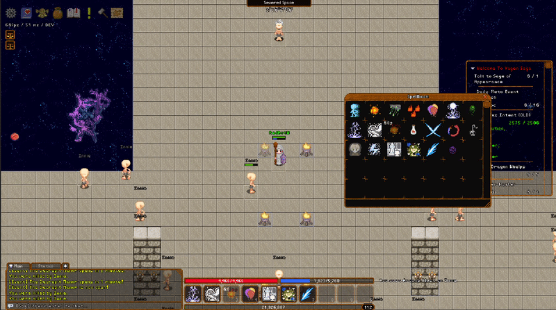
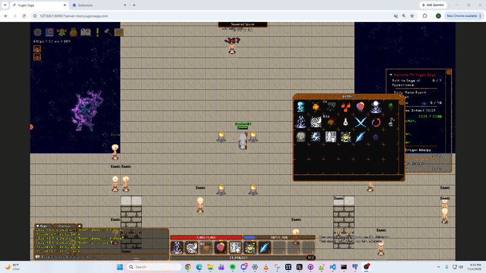
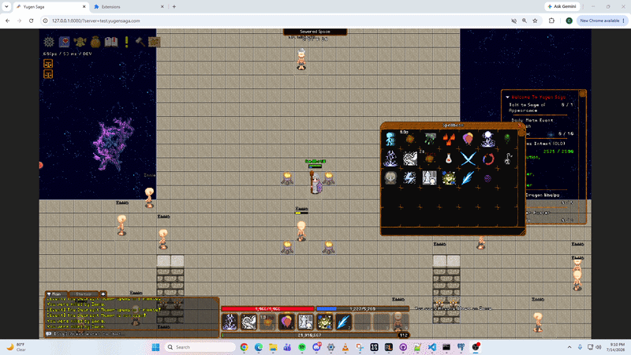
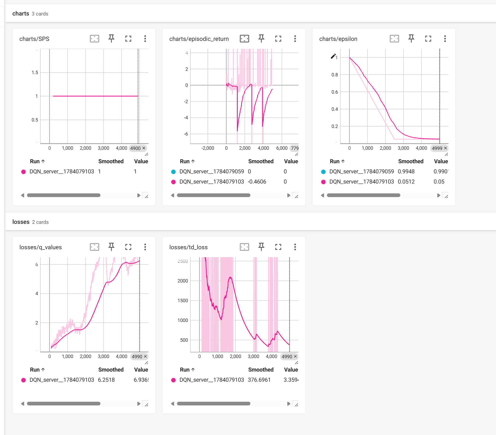

# RL Decision Server

A bridge between a reinforcement learning agent and the Yugen Saga game. The project connects the browser game to Python RL training code through a WebSocket-to-ZMQ bridge, then trains or evaluates agents with custom Gymnasium environments.

## Overview

- `Automation/Bridge/ws_zmq_bridge.py`: translates WebSocket messages from Yugen Saga into ZMQ backend requests.
- `Training/DQN_server.py`: DQN training loop for the current custom environment.
- `Inference/dqn_eval.py`: loads a saved DQN checkpoint and runs evaluation.
- `RunRL.ps1` / `RunRL.sh`: starts TensorBoard, the bridge, and the configured RL algorithm together.
- `Utils/buffers.py`: replay buffer used by DQN.
- `Custom_enviornments/`: shared env config, base env, and class-specific environments.

## DQN Learning Showcase

The clips below show the DQN agent interacting with the live game while it learns to select movement, targeting, and combat actions from the environment state and reward signal.

<p align="center">
  
  
  
</p>

The training dashboard captures the learning signals produced during a demo run, including episodic return, epsilon decay, Q-values, and temporal-difference loss.



## Project Structure

```text
.
|-- requirements.txt
|-- InstallationReadMe.md
|-- RunRL.ps1
|-- RunRL.sh
|-- RunInference.ps1
|-- RunInference.sh
|-- Automation/
|   |-- automation_config.yaml
|   |-- Training_stack.py
|   |-- Inference_stack.py
|   |-- RunTensorboard.bat
|   `-- Bridge/
|       `-- ws_zmq_bridge.py
|-- Utils/
|   `-- buffers.py
|-- Training/
|   |-- DQN_server.py
|   `-- PPO_server.py
|-- Inference/
|   `-- dqn_eval.py
|-- Custom_enviornments/
|   |-- BaseEnv.py
|   |-- Config.yaml
|   |-- Load_env_config.py
|   `-- Test_Env/
|       |-- Env_16.py
|       `-- Env_conditions.py
|-- Tests/
`-- README.md
```

## Custom Environments

Environment code is split by responsibility:

- `Custom_enviornments/Config.yaml`: shared state-space and runtime constants used by all envs.
- `Custom_enviornments/Load_env_config.py`: the only config parser used by environments.
- `Custom_enviornments/BaseEnv.py`: bare Gymnasium/ZMQ base environment.
- `Custom_enviornments/Test_Env/Env_16.py`: example class-specific env with a 16-action discrete action space.
- `Custom_enviornments/Test_Env/Env_conditions.py`: example class-specific observation parsing, rewards, termination, and truncation.

Each new game/class environment should have its own folder, action-space file, and `Env_conditions.py`. Shared state-space config stays in `Config.yaml`; class-specific reward and end-condition logic stays beside that class env.

## Shared Env Config

`Custom_enviornments/Config.yaml` defines the shared state space:

- `ZMQ_BIND_URL`: ZMQ endpoint used by the browser/game bridge.
- `OBS_PLAYER_SIZE`: number of player features.
- `OBS_ENEMY_SIZE`: number of features per tracked enemy.
- `MAX_ENEMIES`: number of enemies included in the observation state.
- `OBS_SIZE`: total observation size, validated as `OBS_PLAYER_SIZE + OBS_ENEMY_SIZE * MAX_ENEMIES`.
- `MAX_EPISODE_STEPS`: shared runtime default that env-specific conditions can use.
- `STATE_DTYPE`: dtype metadata for state tensors.
- `ACTION_SPACE_TYPE`: action-space metadata.

The current observation space is 13 values:

- 5 player features
- 4 enemy features for each of 2 tracked enemies
- missing enemy slots are zero-padded

## Current Env

`Custom_enviornments/Test_Env/Env_16.py` is the active example env used by `Training/DQN_server.py` and `Inference/dqn_eval.py`.

It exposes 16 discrete actions:

- Movement: `up`, `down`, `left`, `right`
- Direction: `direction:up`, `direction:down`, `direction:left`, `direction:right`
- Combat: `attack`
- Spells: `castSpell:1` through `castSpell:7`

## Running Training

Recommended one-command startup:

```powershell
.\RunRL.ps1
```

Or from Bash:

```bash
./RunRL.sh
```

`RunRL` reads `Automation/automation_config.yaml`, starts TensorBoard when enabled, starts `Automation/Bridge/ws_zmq_bridge.py`, waits for the configured bridge-ready signal, then starts the configured RL algorithm through `Automation/Training_stack.py`.

Manual startup is still supported.

Start the WebSocket/ZMQ bridge first:

```bash
python Automation/Bridge/ws_zmq_bridge.py
```

Then start DQN training:

```bash
python Training/DQN_server.py
```

The game must be running and sending `ai_tick` messages through the browser extension before the env can step.

## Monitoring

Training logs are written under `runs/`.

```bash
tensorboard --logdir=runs
```

Open http://localhost:6006.

Useful metrics:

- `charts/episodic_return`
- `charts/epsilon`
- `losses/td_loss`
- `losses/q_values`
- `charts/SPS`

## Evaluation

After training creates a checkpoint:

```bash
python Inference/dqn_eval.py --model_path runs/DQN_server__<timestamp>/DQN_server.pt
```

Optional examples:

```bash
python Inference/dqn_eval.py --model_path runs/DQN_server__<timestamp>/DQN_server.pt --eval_episodes 20
python Inference/dqn_eval.py --model_path runs/DQN_server__<timestamp>/DQN_server.pt --epsilon 0.05
python Inference/dqn_eval.py --model_path runs/DQN_server__<timestamp>/DQN_server.pt --cuda false
```

To run inference with the bridge automation, configure `inference_command` in `Automation/automation_config.yaml` or pass a command:

```powershell
.\RunInference.ps1 -Command "python Inference/dqn_eval.py --model_path runs/DQN_server__<timestamp>/DQN_server.pt"
```

## Notes

- DQN is the active training path for the current discrete action space.
- `Load_env_config.py` should remain the single place that parses shared env config.
- `Automation/automation_config.yaml` controls TensorBoard startup, bridge startup, training command, and inference command.
